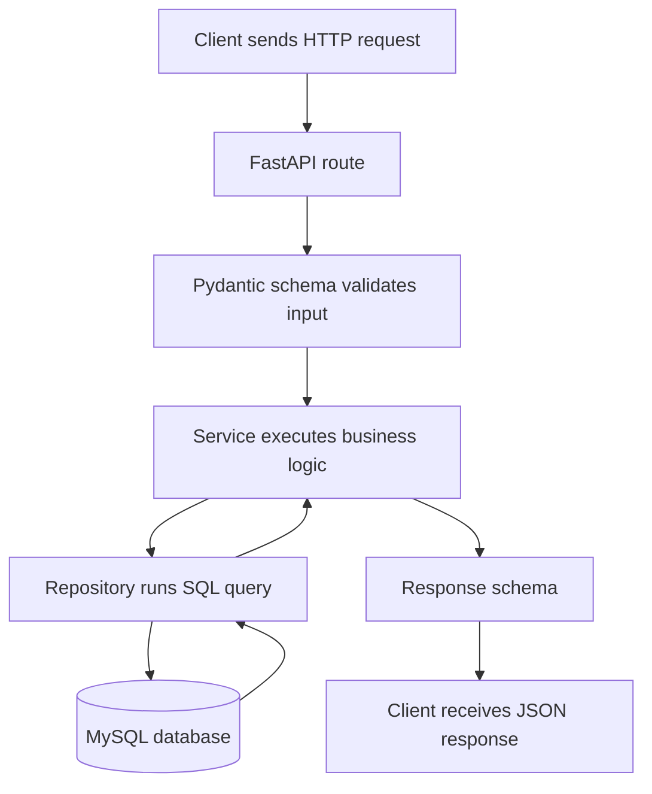

# Smart Wardrobe API

FastAPI + MySQL project using plain SQL with PyMySQL. The code is organized to make it easy to follow how an HTTP request reaches the database.

There is no authentication yet. There are no passwords, JWTs, refresh tokens, sessions, roles, or permissions.

## Stack

- Python 3.12
- FastAPI
- Uvicorn
- PyMySQL
- MySQL 8
- Docker / Docker Compose

## Request Flow

```txt
routes.py recibe la petición HTTP.
api_schema.py valida y describe el JSON HTTP de entrada y salida.
service.py ejecuta la lógica de aplicación.
repository.py habla con MySQL.
database.py crea la conexión.
```



## Project Structure

```txt
app/
├── main.py
├── config.py
├── database.py
├── health/
│   └── routes.py
└── identities/
    ├── routes.py
    ├── api_schema.py
    ├── service.py
    └── repository.py

migrations/
├── 001_create_identities.sql
├── 002_create_identity_profiles.sql
└── 003_seed_dummy_identities.sql

docs/
├── database.md
└── request-flow.md
```

## Identity Model

`identities` stores the minimal system identity.
`identity_profiles` stores app-specific preferences for that identity.
`public_id` is temporarily used as an external identifier until real authentication is implemented.
The internal numeric `id` is used only for database relationships.

## API Endpoints

```txt
GET    /
GET    /health
GET    /identities
POST   /identities
GET    /identities/{public_id}
PATCH  /identities/{public_id}/profile
```

Public responses use `public_id` and never expose the internal `identities.id`.

## Dummy Data

The local database includes dummy identities from `migrations/003_seed_dummy_identities.sql`:

```txt
11111111-1111-4111-8111-111111111111  Alex Morgan
22222222-2222-4222-8222-222222222222  Jordan Lee
```

## Quick Start

Run the full local stack:

```bash
docker compose up --build
```

Open the API:

```txt
http://localhost:8000
```

Open FastAPI docs:

```txt
http://localhost:8000/docs
```

Stop services:

```bash
docker compose down
```

Reset local DB data:

```bash
docker compose down -v
```

## Manual Checks

Create an identity:

```bash
curl -X POST http://localhost:8000/identities \
  -H "Content-Type: application/json" \
  -d '{"display_name":"Sebastian"}'
```

List identities:

```bash
curl http://localhost:8000/identities
```

Get an identity:

```bash
curl http://localhost:8000/identities/11111111-1111-4111-8111-111111111111
```

Patch a profile:

```bash
curl -X PATCH http://localhost:8000/identities/<public_id>/profile \
  -H "Content-Type: application/json" \
  -d '{"cold_sensitivity":0.8,"comfort_priority":0.9}'
```

## Documentation

- [Request Flow](docs/request-flow.md)
- [Database](docs/database.md)
