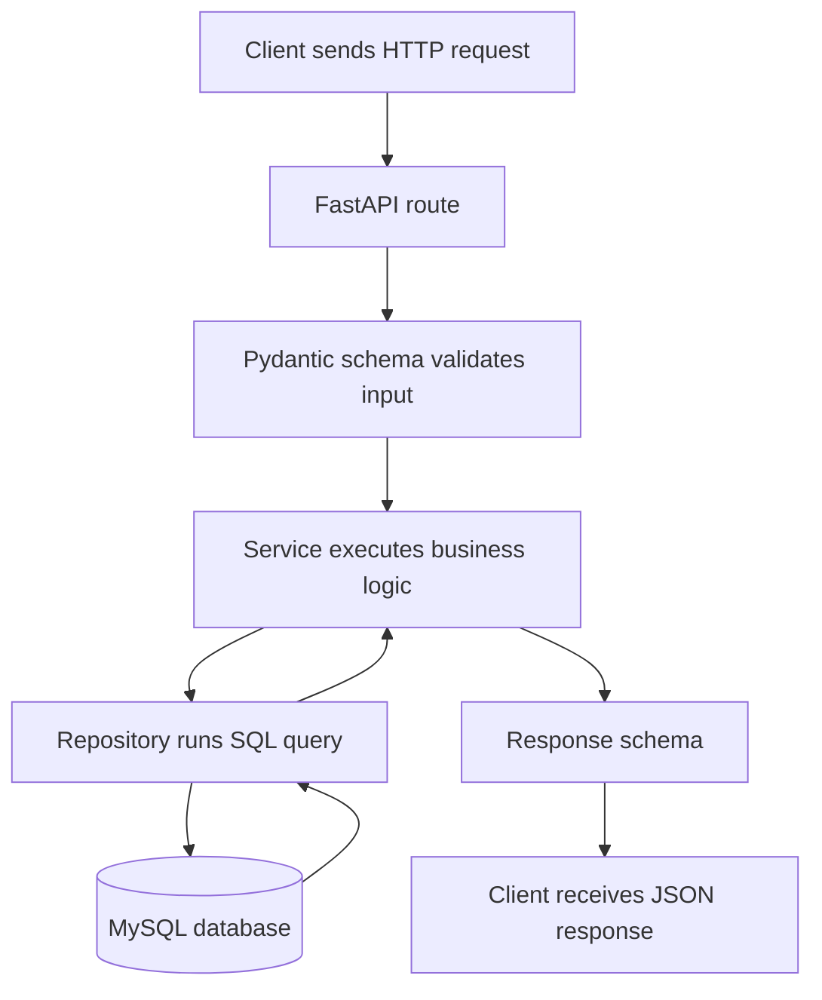

# Smart Wardrobe API

FastAPI + MySQL project using plain SQL with PyMySQL. The code is organized to make it easy to follow how an HTTP request reaches the database.

There is no authentication yet. There are no passwords, JWTs, refresh tokens, sessions, roles, or permissions.

## Stack

- Python 3.12
- FastAPI
- Uvicorn
- PyMySQL
- MySQL 8
- Docker / Docker Compose

## Request Flow

```txt
routes.py recibe la petición HTTP.
api_schema.py valida y describe el JSON HTTP de entrada y salida.
service.py ejecuta la lógica de aplicación.
repository.py habla con MySQL.
database.py crea la conexión.
```



## Project Structure

```txt
app/
├── main.py
├── config.py
├── database.py
├── health/
│   └── routes.py
├── clothing/
│   ├── routes.py
│   ├── schemas.py
│   ├── service.py
│   └── repository.py
└── identities/
    ├── routes.py
    ├── api_schema.py
    ├── service.py
    └── repository.py

migrations/
├── 001_create_identities.sql
├── 002_create_identity_profiles.sql
├── 003_seed_dummy_identities.sql
├── 004_create_clothing_categories.sql
├── 005_create_clothing_items.sql
├── 006_seed_clothing_categories.sql
└── 007_create_clothing_colors.sql

docs/
├── database.md
└── request-flow.md
```

## Identity Model

`identities` stores the minimal system identity.
`identity_profiles` stores app-specific preferences for that identity.
`nickname` is the human-friendly identifier used by the frontend to continue with an existing identity.
`public_id` is kept as a technical external identifier for existing API routes until real authentication is implemented.
The internal numeric `id` is used only for database relationships.

## API Endpoints

```txt
GET    /
GET    /health
GET    /identities
POST   /identities
GET    /identities/nickname/{nickname}
GET    /identities/{public_id}
PATCH  /identities/{public_id}/profile
GET    /clothing-categories
GET    /clothing-colors
POST   /identities/{public_id}/clothing-items
GET    /identities/{public_id}/clothing-items
GET    /identities/{public_id}/clothing-items/{item_id}
PATCH  /identities/{public_id}/clothing-items/{item_id}
PATCH  /identities/{public_id}/clothing-items/{item_id}/status
DELETE /identities/{public_id}/clothing-items/{item_id}
```

Public responses use `public_id` and `nickname`, and never expose the internal `identities.id`.
Clothing item responses do not expose internal `identity_id`.
Colors are read-only API options loaded from `migrations/007_create_clothing_colors.sql`; the API does not expose endpoints to create or edit colors.

## Dummy Data

The local database includes dummy identities from `migrations/003_seed_dummy_identities.sql`:

```txt
11111111-1111-4111-8111-111111111111  Demo User One
22222222-2222-4222-8222-222222222222  Demo User Two
```

## Quick Start

Run the full local stack:

```bash
docker compose up --build
```

Open the API:

```txt
http://localhost:8000
```

Open FastAPI docs:

```txt
http://localhost:8000/docs
```

Stop services:

```bash
docker compose down
```

Reset local DB data:

```bash
docker compose down -v
```

## Manual Checks

Create an identity:

```bash
curl -X POST http://localhost:8000/identities \
  -H "Content-Type: application/json" \
  -d '{"display_name":"Demo User","nickname":"demo_user"}'
```

List identities:

```bash
curl http://localhost:8000/identities
```

Search identities by name:

```bash
curl "http://localhost:8000/identities?name=Demo"
```

Get an identity:

```bash
curl http://localhost:8000/identities/11111111-1111-4111-8111-111111111111
```

Patch a profile:

```bash
curl -X PATCH http://localhost:8000/identities/<public_id>/profile \
  -H "Content-Type: application/json" \
  -d '{"cold_sensitivity":0.8,"comfort_priority":0.9}'
```

List clothing categories:

```bash
curl http://localhost:8000/clothing-categories
```

List clothing colors:

```bash
curl http://localhost:8000/clothing-colors
```

Create a clothing item:

```bash
curl -X POST http://localhost:8000/identities/11111111-1111-4111-8111-111111111111/clothing-items \
  -H "Content-Type: application/json" \
  -d '{"category_name":"top","name":"Black hoodie","color":"black","material":"cotton","image_url":"https://example.com/hoodie.jpg","warmth_rating":0.75,"comfort_rating":0.9,"formality_rating":0.3,"rain_rating":0.2,"wind_rating":0.4,"current_status":"clean"}'
```

List clothing items for an identity:

```bash
curl http://localhost:8000/identities/11111111-1111-4111-8111-111111111111/clothing-items
```

Get one clothing item:

```bash
curl http://localhost:8000/identities/11111111-1111-4111-8111-111111111111/clothing-items/<item_id>
```

Patch a clothing item:

```bash
curl -X PATCH http://localhost:8000/identities/11111111-1111-4111-8111-111111111111/clothing-items/<item_id> \
  -H "Content-Type: application/json" \
  -d '{"color":"dark gray","comfort_rating":0.95}'
```

Update clothing item status:

```bash
curl -X PATCH http://localhost:8000/identities/11111111-1111-4111-8111-111111111111/clothing-items/<item_id>/status \
  -H "Content-Type: application/json" \
  -d '{"current_status":"worn"}'
```

Soft delete a clothing item:

```bash
curl -X DELETE http://localhost:8000/identities/11111111-1111-4111-8111-111111111111/clothing-items/<item_id>
```

## Documentation

- [Request Flow](docs/request-flow.md)
- [Database](docs/database.md)
