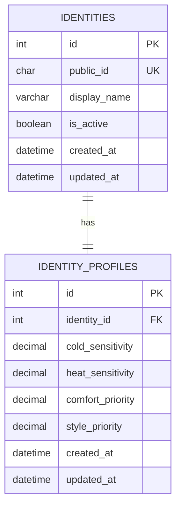

# Database

`identities` stores the minimal system identity.
`identity_profiles` stores app-specific preferences for that identity.
`public_id` is temporarily used as an external identifier until real authentication is implemented.
The internal numeric `id` is used only for database relationships.

`migrations/003_seed_dummy_identities.sql` creates two dummy identities for local testing: `Alex Morgan` and `Jordan Lee`.

