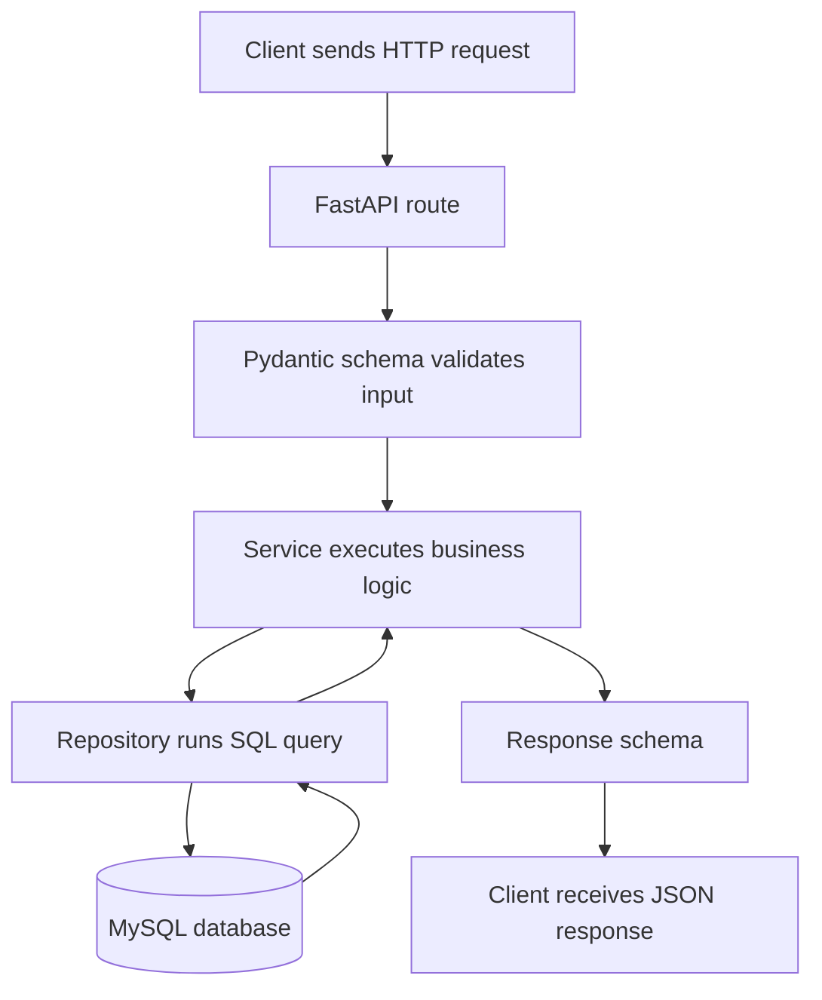

# Request Flow

This project intentionally uses a simple route -> API schema -> service -> repository -> database structure.

```txt
Request HTTP
-> routes.py
-> api_schema.py
-> service.py
-> repository.py
-> database.py
-> MySQL
```



`routes.py` receives the HTTP request and converts application errors into HTTP responses.
`api_schema.py` validates and describes HTTP request and response shapes with Pydantic.
`service.py` contains application logic, like generating the UUID v4 `public_id`.
`repository.py` contains SQL queries.
`database.py` creates MySQL connections.
